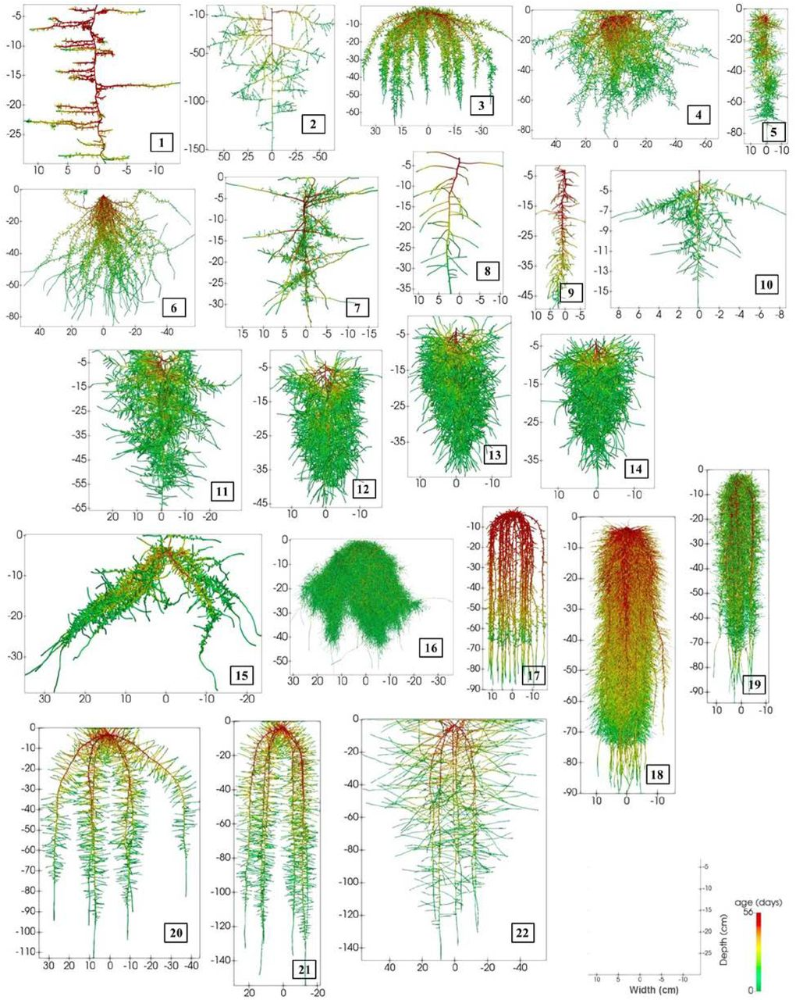

# Dendritic_OT

Numerical survey of the article
Optimal Transport and barycenters for dendritic measures
Young-Heon Kim, Brendan Pass, David J. Schneider

## Root species

1. Anagallis femina
2. Brassica napus
3. Brassica oleracea
4. Crypsis aculeata
5. Helianthus L.
6. Juncus squarrosus
7. Lupinus albus
8. Lupinus angustifolius
9. Medicago truncatula
10. Noccaea caerulescens
11. Pisum sativum a
12. Pisum sativum b
13. Pisum sativum c
14. Pisum sativum d
15. Sorghum bicolor
16. Triticum aestivum
17. Zea mays 1
18. Zea mays 2
19. Zea mays 3
20. Zea mays 4
21. Zea mays 5
22. Zea mays 6
